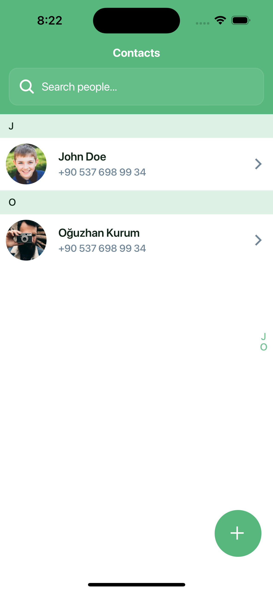
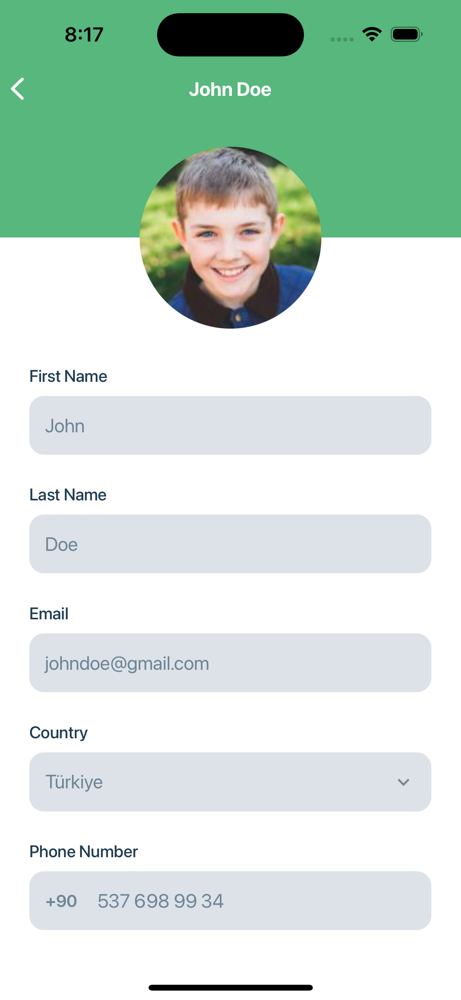
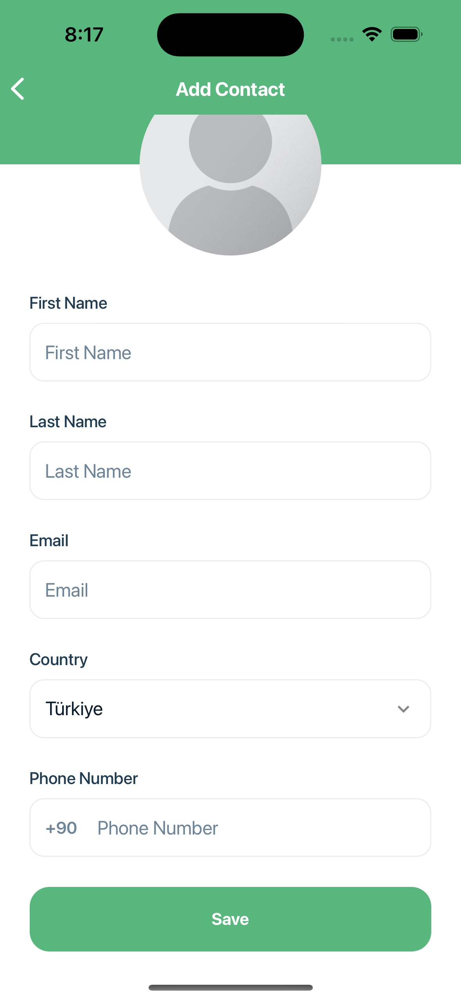

# React Native Contacts App

This is a React Native Contacts app.

## Screenshots

<div style="display: flex; flex-direction: 'row';">



</div>

### UI Design Template:

- [Chatme - Messenger Chat App UI Kit](https://ui8.net/toko-design-206804/products/chatme---messenger-chat-app-ui-kit)

### Additional Features

- [React Navigation](https://reactnavigation.org/docs/getting-started) navigation and routes
- [Reanimated 3](https://docs.swmansion.com/react-native-reanimated/) for animations
- [Gesture Handler](https://docs.swmansion.com/react-native-gesture-handler/) for gestures
- [Zustand](https://zustand-demo.pmnd.rs/) for state management
- [AsyncStorage](https://github.com/react-native-async-storage/async-storage) for local storage
- [SectionAlphabetList](https://github.com/Kieran-McIntyre/react-native-section-alphabet-list) for listing contacts
- [Formik](https://formik.org/docs/overview) for form management
- [Yup](https://github.com/jquense/yup) for form validation

### Hooks

This directory holds a reference to all the re-usable hooks

- useAssets

### Utils

This directory holds a reference to all the re-usable utils, helpers & constants

- helpers

## Requirements

Node 14 or newer is required. Development for iOS requires a Mac and Xcode, and will target iOS 12.4 and up.

You also need to install the dependencies required by React Native.
Go to the [React Native environment setup](https://reactnative.dev/docs/environment-setup), then select `Expo Go Quickstart` tab.
Follow the instructions.


## Quick start

To create a new project using the seed simply the following steps:

- Clone the project

```
git clone https://github.com/oguzhankurumm/contacts-app.git
```

- Enter the project folder

```
cd contacts-app
```

- Install the dependencies

```
yarn install
```

- Run app

```
yarn run start
```

</div>